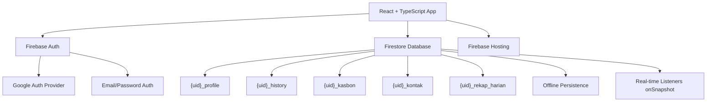
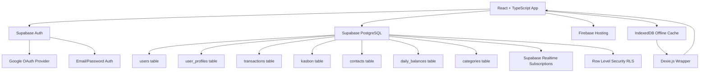
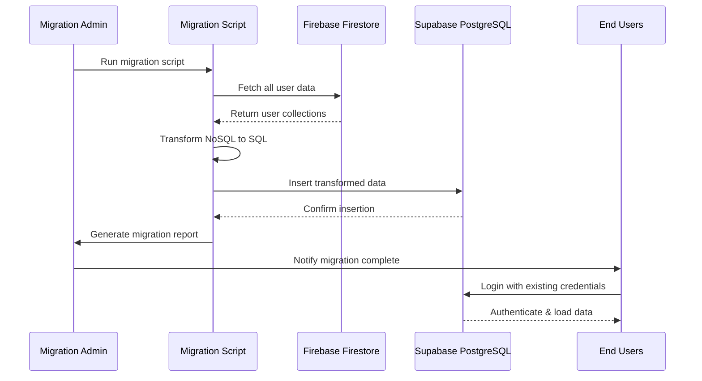
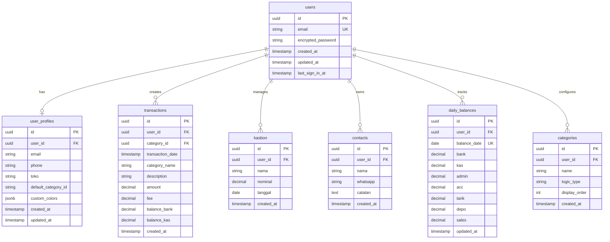

# Design Document: Firebase to Supabase Migration

## Overview

This design document outlines the comprehensive migration strategy for the KINK (Kasir Agen Brilink) application from Firebase (Firestore + Firebase Auth) to Supabase (PostgreSQL + Supabase Auth). The migration preserves all existing functionality including real-time updates, multi-user support, transaction management, kasbon tracking, and contact management while transitioning from a NoSQL document-based architecture to a relational SQL database. The design includes both high-level system architecture and low-level implementation details including database schema, API patterns, real-time subscriptions, offline support strategies, and data migration scripts.

**Key Migration Goals:**
- Migrate from Firestore NoSQL to PostgreSQL relational database
- Migrate from Firebase Auth to Supabase Auth
- Maintain Firebase Hosting for static assets
- Preserve real-time functionality using Supabase Realtime
- Implement offline support strategy (Supabase lacks native offline persistence)
- Ensure zero data loss during migration
- Maintain backward compatibility during transition period

## Architecture

### Current Firebase Architecture



### Target Supabase Architecture



### Migration Architecture Flow



## Database Schema Design

### Entity Relationship Diagram (ERD)



### SQL Schema Definition

```sql
-- Enable UUID extension
CREATE EXTENSION IF NOT EXISTS "uuid-ossp";

-- Users table (managed by Supabase Auth)
-- This table is automatically created by Supabase Auth
-- We reference auth.users in our foreign keys

-- User Profiles Table
CREATE TABLE user_profiles (
    id UUID PRIMARY KEY DEFAULT uuid_generate_v4(),
    user_id UUID NOT NULL REFERENCES auth.users(id) ON DELETE CASCADE,
    email VARCHAR(255) NOT NULL,
    phone VARCHAR(50),
    toko VARCHAR(255) NOT NULL DEFAULT 'Toko Baru',
    default_category_id UUID,
    custom_colors JSONB DEFAULT '{}',
    created_at TIMESTAMP WITH TIME ZONE DEFAULT NOW(),
    updated_at TIMESTAMP WITH TIME ZONE DEFAULT NOW(),
    UNIQUE(user_id)
);

-- Categories Table
CREATE TABLE categories (
    id UUID PRIMARY KEY DEFAULT uuid_generate_v4(),
    user_id UUID NOT NULL REFERENCES auth.users(id) ON DELETE CASCADE,
    name VARCHAR(100) NOT NULL,
    logic_type VARCHAR(20) NOT NULL CHECK (logic_type IN ('BANK_OUT', 'BANK_IN', 'LABA_ACC', 'LABA_ADMIN', 'NONE')),
    display_order INT DEFAULT 0,
    created_at TIMESTAMP WITH TIME ZONE DEFAULT NOW()
);

-- Transactions Table
CREATE TABLE transactions (
    id UUID PRIMARY KEY DEFAULT uuid_generate_v4(),
    user_id UUID NOT NULL REFERENCES auth.users(id) ON DELETE CASCADE,
    category_id UUID REFERENCES categories(id) ON DELETE SET NULL,
    transaction_date TIMESTAMP WITH TIME ZONE NOT NULL DEFAULT NOW(),
    category_name VARCHAR(100) NOT NULL,
    description TEXT,
    amount DECIMAL(15, 2) NOT NULL,
    fee DECIMAL(15, 2) DEFAULT 0,
    balance_bank DECIMAL(15, 2),
    balance_kas DECIMAL(15, 2),
    created_at TIMESTAMP WITH TIME ZONE DEFAULT NOW()
);

-- Kasbon Table
CREATE TABLE kasbon (
    id UUID PRIMARY KEY DEFAULT uuid_generate_v4(),
    user_id UUID NOT NULL REFERENCES auth.users(id) ON DELETE CASCADE,
    nama VARCHAR(255) NOT NULL,
    nominal DECIMAL(15, 2) NOT NULL,
    tanggal DATE NOT NULL,
    created_at TIMESTAMP WITH TIME ZONE DEFAULT NOW()
);

-- Contacts Table
CREATE TABLE contacts (
    id UUID PRIMARY KEY DEFAULT uuid_generate_v4(),
    user_id UUID NOT NULL REFERENCES auth.users(id) ON DELETE CASCADE,
    nama VARCHAR(255) NOT NULL,
    whatsapp VARCHAR(50),
    catatan TEXT,
    created_at TIMESTAMP WITH TIME ZONE DEFAULT NOW()
);

-- Daily Balances Table
CREATE TABLE daily_balances (
    id UUID PRIMARY KEY DEFAULT uuid_generate_v4(),
    user_id UUID NOT NULL REFERENCES auth.users(id) ON DELETE CASCADE,
    balance_date DATE NOT NULL,
    bank DECIMAL(15, 2) DEFAULT 0,
    kas DECIMAL(15, 2) DEFAULT 0,
    admin DECIMAL(15, 2) DEFAULT 0,
    acc DECIMAL(15, 2) DEFAULT 0,
    tarik DECIMAL(15, 2) DEFAULT 0,
    depo DECIMAL(15, 2) DEFAULT 0,
    sales DECIMAL(15, 2) DEFAULT 0,
    updated_at TIMESTAMP WITH TIME ZONE DEFAULT NOW(),
    UNIQUE(user_id, balance_date)
);

-- Indexes for performance optimization
CREATE INDEX idx_transactions_user_date ON transactions(user_id, transaction_date DESC);
CREATE INDEX idx_transactions_category ON transactions(category_id);
CREATE INDEX idx_kasbon_user ON kasbon(user_id);
CREATE INDEX idx_contacts_user ON contacts(user_id);
CREATE INDEX idx_daily_balances_user_date ON daily_balances(user_id, balance_date DESC);
CREATE INDEX idx_categories_user ON categories(user_id);

-- Foreign key for default_category_id in user_profiles
ALTER TABLE user_profiles 
ADD CONSTRAINT fk_default_category 
FOREIGN KEY (default_category_id) 
REFERENCES categories(id) 
ON DELETE SET NULL;
```

### Row Level Security (RLS) Policies

```sql
-- Enable RLS on all tables
ALTER TABLE user_profiles ENABLE ROW LEVEL SECURITY;
ALTER TABLE categories ENABLE ROW LEVEL SECURITY;
ALTER TABLE transactions ENABLE ROW LEVEL SECURITY;
ALTER TABLE kasbon ENABLE ROW LEVEL SECURITY;
ALTER TABLE contacts ENABLE ROW LEVEL SECURITY;
ALTER TABLE daily_balances ENABLE ROW LEVEL SECURITY;

-- User Profiles Policies
CREATE POLICY "Users can view own profile" 
ON user_profiles FOR SELECT 
USING (auth.uid() = user_id);

CREATE POLICY "Users can update own profile" 
ON user_profiles FOR UPDATE 
USING (auth.uid() = user_id);

CREATE POLICY "Users can insert own profile" 
ON user_profiles FOR INSERT 
WITH CHECK (auth.uid() = user_id);

-- Categories Policies
CREATE POLICY "Users can view own categories" 
ON categories FOR SELECT 
USING (auth.uid() = user_id);

CREATE POLICY "Users can manage own categories" 
ON categories FOR ALL 
USING (auth.uid() = user_id);

-- Transactions Policies
CREATE POLICY "Users can view own transactions" 
ON transactions FOR SELECT 
USING (auth.uid() = user_id);

CREATE POLICY "Users can insert own transactions" 
ON transactions FOR INSERT 
WITH CHECK (auth.uid() = user_id);

CREATE POLICY "Users can delete own transactions" 
ON transactions FOR DELETE 
USING (auth.uid() = user_id);

-- Kasbon Policies
CREATE POLICY "Users can view own kasbon" 
ON kasbon FOR SELECT 
USING (auth.uid() = user_id);

CREATE POLICY "Users can manage own kasbon" 
ON kasbon FOR ALL 
USING (auth.uid() = user_id);

-- Contacts Policies
CREATE POLICY "Users can view own contacts" 
ON contacts FOR SELECT 
USING (auth.uid() = user_id);

CREATE POLICY "Users can manage own contacts" 
ON contacts FOR ALL 
USING (auth.uid() = user_id);

-- Daily Balances Policies
CREATE POLICY "Users can view own balances" 
ON daily_balances FOR SELECT 
USING (auth.uid() = user_id);

CREATE POLICY "Users can manage own balances" 
ON daily_balances FOR ALL 
USING (auth.uid() = user_id);
```

### Database Triggers and Functions

```sql
-- Function to update updated_at timestamp
CREATE OR REPLACE FUNCTION update_updated_at_column()
RETURNS TRIGGER AS $$
BEGIN
    NEW.updated_at = NOW();
    RETURN NEW;
END;
$$ LANGUAGE plpgsql;

-- Trigger for user_profiles
CREATE TRIGGER update_user_profiles_updated_at
BEFORE UPDATE ON user_profiles
FOR EACH ROW
EXECUTE FUNCTION update_updated_at_column();

-- Trigger for daily_balances
CREATE TRIGGER update_daily_balances_updated_at
BEFORE UPDATE ON daily_balances
FOR EACH ROW
EXECUTE FUNCTION update_updated_at_column();

-- Function to initialize default categories for new users
CREATE OR REPLACE FUNCTION initialize_user_categories()
RETURNS TRIGGER AS $$
DECLARE
    cat_bank_out UUID;
BEGIN
    -- Insert default categories
    INSERT INTO categories (user_id, name, logic_type, display_order)
    VALUES 
        (NEW.id, 'Transfer Bank', 'BANK_OUT', 1),
        (NEW.id, 'Tarik Tunai', 'BANK_IN', 2),
        (NEW.id, 'Aksesoris', 'LABA_ACC', 3),
        (NEW.id, 'Admin/Fee', 'LABA_ADMIN', 4)
    RETURNING id INTO cat_bank_out
    WHERE name = 'Transfer Bank';
    
    -- Create user profile with default category
    INSERT INTO user_profiles (user_id, email, toko, default_category_id)
    VALUES (NEW.id, NEW.email, 'Toko Baru', cat_bank_out);
    
    RETURN NEW;
END;
$$ LANGUAGE plpgsql SECURITY DEFINER;

-- Trigger to initialize categories when user signs up
CREATE TRIGGER on_auth_user_created
AFTER INSERT ON auth.users
FOR EACH ROW
EXECUTE FUNCTION initialize_user_categories();
```

## Components and Interfaces

### Supabase Client Service

**Purpose**: Centralized Supabase client configuration and initialization

**Interface**:
```typescript
// src/services/supabase.ts

import { createClient, SupabaseClient, User, Session } from '@supabase/supabase-js';

interface Database {
  public: {
    Tables: {
      user_profiles: UserProfileRow;
      categories: CategoryRow;
      transactions: TransactionRow;
      kasbon: KasbonRow;
      contacts: ContactRow;
      daily_balances: DailyBalanceRow;
    };
  };
}

const supabaseUrl: string;
const supabaseAnonKey: string;
const supabase: SupabaseClient<Database>;

function getSupabaseClient(): SupabaseClient<Database>;
```

**Responsibilities**:
- Initialize Supabase client with project credentials
- Export typed client for use across application
- Provide type-safe database access

### Authentication Service

**Purpose**: Handle user authentication operations

**Interface**:
```typescript
// src/services/auth.ts

interface AuthService {
  signInWithEmail(email: string, password: string): Promise<{ user: User; session: Session }>;
  signUpWithEmail(email: string, password: string): Promise<{ user: User; session: Session }>;
  signInWithGoogle(): Promise<{ user: User; session: Session }>;
  signOut(): Promise<void>;
  getCurrentUser(): User | null;
  onAuthStateChange(callback: (user: User | null) => void): () => void;
  updatePassword(newPassword: string): Promise<void>;
}
```

**Responsibilities**:
- Manage user authentication with Supabase Auth
- Handle Google OAuth flow
- Provide auth state change listeners
- Manage session persistence

### Data Access Layer

**Purpose**: Abstract database operations with type-safe methods

**Interface**:
```typescript
// src/services/database.ts

interface DatabaseService {
  // Profile operations
  getUserProfile(userId: string): Promise<UserProfile | null>;
  updateUserProfile(userId: string, updates: Partial<UserProfile>): Promise<void>;
  
  // Category operations
  getUserCategories(userId: string): Promise<Category[]>;
  addCategory(userId: string, category: Omit<Category, 'id'>): Promise<Category>;
  updateCategory(categoryId: string, updates: Partial<Category>): Promise<void>;
  deleteCategory(categoryId: string): Promise<void>;
  
  // Transaction operations
  getTransactions(userId: string, startDate?: Date, limit?: number): Promise<HistoryItem[]>;
  addTransaction(userId: string, transaction: Omit<HistoryItem, 'id'>): Promise<HistoryItem>;
  deleteTransaction(transactionId: string): Promise<void>;
  
  // Kasbon operations
  getKasbon(userId: string): Promise<Kasbon[]>;
  addKasbon(userId: string, kasbon: Omit<Kasbon, 'id'>): Promise<Kasbon>;
  deleteKasbon(kasbonId: string): Promise<void>;
  
  // Contact operations
  getContacts(userId: string): Promise<Kontak[]>;
  addContact(userId: string, contact: Omit<Kontak, 'id'>): Promise<Kontak>;
  deleteContact(contactId: string): Promise<void>;
  
  // Balance operations
  getDailyBalance(userId: string, date: Date): Promise<Balances>;
  updateDailyBalance(userId: string, date: Date, balances: Balances): Promise<void>;
}
```

**Responsibilities**:
- Provide type-safe CRUD operations for all entities
- Handle SQL query construction
- Manage error handling and validation
- Abstract Supabase client from application code

### Real-time Subscription Service

**Purpose**: Manage real-time data subscriptions using Supabase Realtime

**Interface**:
```typescript
// src/services/realtime.ts

interface RealtimeService {
  subscribeToProfile(userId: string, callback: (profile: UserProfile) => void): () => void;
  subscribeToCategories(userId: string, callback: (categories: Category[]) => void): () => void;
  subscribeToTransactions(userId: string, callback: (transactions: HistoryItem[]) => void): () => void;
  subscribeToKasbon(userId: string, callback: (kasbon: Kasbon[]) => void): () => void;
  subscribeToContacts(userId: string, callback: (contacts: Kontak[]) => void): () => void;
  subscribeToDailyBalance(userId: string, date: Date, callback: (balance: Balances) => void): () => void;
  unsubscribeAll(): void;
}
```

**Responsibilities**:
- Set up Supabase Realtime channels for each table
- Handle real-time INSERT, UPDATE, DELETE events
- Provide cleanup functions for subscriptions
- Manage subscription lifecycle

### Offline Storage Service

**Purpose**: Provide offline data persistence using IndexedDB

**Interface**:
```typescript
// src/services/offline.ts

interface OfflineStorageService {
  // Cache operations
  cacheProfile(userId: string, profile: UserProfile): Promise<void>;
  cacheCategories(userId: string, categories: Category[]): Promise<void>;
  cacheTransactions(userId: string, transactions: HistoryItem[]): Promise<void>;
  cacheKasbon(userId: string, kasbon: Kasbon[]): Promise<void>;
  cacheContacts(userId: string, contacts: Kontak[]): Promise<void>;
  cacheBalances(userId: string, balances: Balances): Promise<void>;
  
  // Retrieve cached data
  getCachedProfile(userId: string): Promise<UserProfile | null>;
  getCachedCategories(userId: string): Promise<Category[]>;
  getCachedTransactions(userId: string): Promise<HistoryItem[]>;
  getCachedKasbon(userId: string): Promise<Kasbon[]>;
  getCachedContacts(userId: string): Promise<Kontak[]>;
  getCachedBalances(userId: string): Promise<Balances | null>;
  
  // Pending operations queue
  queueOperation(operation: PendingOperation): Promise<void>;
  getPendingOperations(): Promise<PendingOperation[]>;
  clearPendingOperation(operationId: string): Promise<void>;
  
  // Clear cache
  clearUserCache(userId: string): Promise<void>;
}

interface PendingOperation {
  id: string;
  type: 'INSERT' | 'UPDATE' | 'DELETE';
  table: string;
  data: any;
  timestamp: number;
}
```

**Responsibilities**:
- Store data locally in IndexedDB using Dexie.js
- Queue operations when offline
- Sync pending operations when connection restored
- Provide fallback data when offline

### Migration Script Service

**Purpose**: Migrate existing Firebase data to Supabase

**Interface**:
```typescript
// scripts/migrate.ts

interface MigrationService {
  migrateAllUsers(): Promise<MigrationReport>;
  migrateUser(firebaseUid: string): Promise<UserMigrationResult>;
  validateMigration(firebaseUid: string, supabaseUserId: string): Promise<ValidationReport>;
  generateMigrationReport(): Promise<MigrationReport>;
}

interface MigrationReport {
  totalUsers: number;
  successfulMigrations: number;
  failedMigrations: number;
  errors: MigrationError[];
  duration: number;
}

interface UserMigrationResult {
  firebaseUid: string;
  supabaseUserId: string;
  profileMigrated: boolean;
  categoriesMigrated: number;
  transactionsMigrated: number;
  kasbonMigrated: number;
  contactsMigrated: number;
  balancesMigrated: number;
  errors: string[];
}
```

**Responsibilities**:
- Read data from Firebase Firestore
- Transform NoSQL documents to SQL rows
- Insert data into Supabase PostgreSQL
- Handle migration errors and rollback
- Generate migration reports

## Data Models

### TypeScript Type Definitions

```typescript
// src/types/database.ts

// Database row types (snake_case from PostgreSQL)
export interface UserProfileRow {
  id: string;
  user_id: string;
  email: string;
  phone: string | null;
  toko: string;
  default_category_id: string | null;
  custom_colors: CustomColors | null;
  created_at: string;
  updated_at: string;
}

export interface CategoryRow {
  id: string;
  user_id: string;
  name: string;
  logic_type: 'BANK_OUT' | 'BANK_IN' | 'LABA_ACC' | 'LABA_ADMIN' | 'NONE';
  display_order: number;
  created_at: string;
}

export interface TransactionRow {
  id: string;
  user_id: string;
  category_id: string | null;
  transaction_date: string;
  category_name: string;
  description: string | null;
  amount: number;
  fee: number;
  balance_bank: number | null;
  balance_kas: number | null;
  created_at: string;
}

export interface KasbonRow {
  id: string;
  user_id: string;
  nama: string;
  nominal: number;
  tanggal: string;
  created_at: string;
}

export interface ContactRow {
  id: string;
  user_id: string;
  nama: string;
  whatsapp: string | null;
  catatan: string | null;
  created_at: string;
}

export interface DailyBalanceRow {
  id: string;
  user_id: string;
  balance_date: string;
  bank: number;
  kas: number;
  admin: number;
  acc: number;
  tarik: number;
  depo: number;
  sales: number;
  updated_at: string;
}

// Application types (camelCase for React components)
// Keep existing types from src/types/index.ts
export interface UserProfile {
  email: string;
  phone: string;
  toko: string;
  defaultCategory: string;
  categories: Category[];
  colors?: CustomColors;
}

export interface Category {
  id: string;
  name: string;
  logicType: 'BANK_OUT' | 'BANK_IN' | 'LABA_ACC' | 'LABA_ADMIN' | 'NONE';
}

export interface Balances {
  bank: number;
  kas: number;
  admin: number;
  acc: number;
  tarik: number;
  depo: number;
  sales: number;
}

export interface HistoryItem {
  id?: string;
  tgl: string;
  kat: string;
  katId?: string;
  ket: string;
  amt: number;
  fee?: number;
  balBank?: number;
  balKas?: number;
}

export interface Kasbon {
  id?: string;
  nama: string;
  nominal: number;
  tgl: string;
}

export interface Kontak {
  id?: string;
  nama: string;
  wa: string;
  catatan: string;
  createdAt: string;
}

export interface CustomColors {
  theme?: string;
  appBg?: string;
  bank?: string;
  cash?: string;
  admin?: string;
  acc?: string;
  tarik?: string;
}
```

### Data Transformation Utilities

```typescript
// src/utils/transformers.ts

// Convert database row to application model
export function rowToUserProfile(row: UserProfileRow, categories: Category[]): UserProfile {
  return {
    email: row.email,
    phone: row.phone || '',
    toko: row.toko,
    defaultCategory: row.default_category_id || '',
    categories: categories,
    colors: row.custom_colors || undefined
  };
}

export function rowToCategory(row: CategoryRow): Category {
  return {
    id: row.id,
    name: row.name,
    logicType: row.logic_type
  };
}

export function rowToHistoryItem(row: TransactionRow): HistoryItem {
  return {
    id: row.id,
    tgl: row.transaction_date,
    kat: row.category_name,
    katId: row.category_id || undefined,
    ket: row.description || '',
    amt: row.amount,
    fee: row.fee,
    balBank: row.balance_bank || undefined,
    balKas: row.balance_kas || undefined
  };
}

export function rowToKasbon(row: KasbonRow): Kasbon {
  return {
    id: row.id,
    nama: row.nama,
    nominal: row.nominal,
    tgl: row.tanggal
  };
}

export function rowToKontak(row: ContactRow): Kontak {
  return {
    id: row.id,
    nama: row.nama,
    wa: row.whatsapp || '',
    catatan: row.catatan || '',
    createdAt: row.created_at
  };
}

export function rowToBalances(row: DailyBalanceRow): Balances {
  return {
    bank: row.bank,
    kas: row.kas,
    admin: row.admin,
    acc: row.acc,
    tarik: row.tarik,
    depo: row.depo,
    sales: row.sales
  };
}
```

## Algorithmic Pseudocode

### Main Data Synchronization Algorithm

```pascal
ALGORITHM synchronizeUserData(userId)
INPUT: userId of type UUID
OUTPUT: syncResult of type SyncResult

PRECONDITION: userId is valid and user is authenticated
POSTCONDITION: All user data is synchronized between server and local cache

BEGIN
  ASSERT userId IS NOT NULL
  ASSERT isAuthenticated() = true
  
  // Step 1: Check network connectivity
  isOnline ← checkNetworkStatus()
  
  IF isOnline = false THEN
    // Load from offline cache
    profile ← offlineStorage.getCachedProfile(userId)
    categories ← offlineStorage.getCachedCategories(userId)
    transactions ← offlineStorage.getCachedTransactions(userId)
    kasbon ← offlineStorage.getCachedKasbon(userId)
    contacts ← offlineStorage.getCachedContacts(userId)
    balances ← offlineStorage.getCachedBalances(userId)
    
    RETURN SyncResult(source: "cache", data: {profile, categories, transactions, kasbon, contacts, balances})
  END IF
  
  // Step 2: Process pending offline operations
  pendingOps ← offlineStorage.getPendingOperations()
  
  FOR each operation IN pendingOps DO
    TRY
      executeOperation(operation)
      offlineStorage.clearPendingOperation(operation.id)
    CATCH error
      LOG error
      // Keep operation in queue for retry
    END TRY
  END FOR
  
  // Step 3: Fetch fresh data from Supabase
  profile ← database.getUserProfile(userId)
  categories ← database.getUserCategories(userId)
  transactions ← database.getTransactions(userId, startDate: today, limit: 500)
  kasbon ← database.getKasbon(userId)
  contacts ← database.getContacts(userId)
  balances ← database.getDailyBalance(userId, date: today)
  
  // Step 4: Update local cache
  offlineStorage.cacheProfile(userId, profile)
  offlineStorage.cacheCategories(userId, categories)
  offlineStorage.cacheTransactions(userId, transactions)
  offlineStorage.cacheKasbon(userId, kasbon)
  offlineStorage.cacheContacts(userId, contacts)
  offlineStorage.cacheBalances(userId, balances)
  
  // Step 5: Set up real-time subscriptions
  setupRealtimeSubscriptions(userId)
  
  ASSERT profile IS NOT NULL
  ASSERT categories.length > 0
  
  RETURN SyncResult(source: "server", data: {profile, categories, transactions, kasbon, contacts, balances})
END
```

**Preconditions:**
- userId is a valid UUID
- User is authenticated with Supabase Auth
- Database connection is available (or offline cache exists)

**Postconditions:**
- All user data is loaded into application state
- Local cache is updated with latest data
- Real-time subscriptions are active (if online)
- Pending offline operations are processed (if online)

**Loop Invariants:**
- All processed pending operations are either successfully executed or logged as errors
- Cache remains consistent with server data after each operation

### Transaction Processing Algorithm

```pascal
ALGORITHM processTransaction(userId, categoryId, amount, fee, description)
INPUT: userId, categoryId, amount, fee, description
OUTPUT: result of type TransactionResult

PRECONDITION: userId and categoryId are valid UUIDs
PRECONDITION: amount > 0
POSTCONDITION: Transaction is recorded and balances are updated

BEGIN
  ASSERT userId IS NOT NULL
  ASSERT categoryId IS NOT NULL
  ASSERT amount > 0
  
  // Step 1: Fetch current balances
  today ← getCurrentDate()
  currentBalances ← database.getDailyBalance(userId, today)
  
  // Step 2: Fetch category logic
  category ← database.getCategoryById(categoryId)
  ASSERT category IS NOT NULL
  
  logicType ← category.logic_type
  newBalances ← COPY(currentBalances)
  
  // Step 3: Apply business logic based on category type
  IF logicType = "BANK_OUT" THEN
    newBalances.bank ← newBalances.bank - amount
    newBalances.admin ← newBalances.admin + fee
    newBalances.sales ← newBalances.sales + amount
  ELSE IF logicType = "BANK_IN" THEN
    newBalances.bank ← newBalances.bank + amount
    newBalances.admin ← newBalances.admin + fee
    newBalances.tarik ← newBalances.tarik + amount
  ELSE IF logicType = "LABA_ACC" THEN
    newBalances.acc ← newBalances.acc + amount
  ELSE IF logicType = "LABA_ADMIN" THEN
    newBalances.admin ← newBalances.admin + amount
  END IF
  
  // Step 4: Calculate current kas balance
  kasBalance ← newBalances.sales + newBalances.admin + newBalances.acc - newBalances.tarik + newBalances.kas
  
  // Step 5: Create transaction record
  transaction ← {
    user_id: userId,
    category_id: categoryId,
    transaction_date: NOW(),
    category_name: category.name,
    description: description,
    amount: amount,
    fee: fee,
    balance_bank: newBalances.bank,
    balance_kas: kasBalance
  }
  
  // Step 6: Check if online or offline
  IF isOnline() THEN
    // Execute immediately
    savedTransaction ← database.addTransaction(userId, transaction)
    database.updateDailyBalance(userId, today, newBalances)
  ELSE
    // Queue for later
    offlineStorage.queueOperation({
      type: "INSERT",
      table: "transactions",
      data: transaction
    })
    offlineStorage.queueOperation({
      type: "UPDATE",
      table: "daily_balances",
      data: newBalances
    })
  END IF
  
  ASSERT newBalances IS NOT NULL
  RETURN TransactionResult(success: true, transaction: savedTransaction, balances: newBalances)
END
```

**Preconditions:**
- userId and categoryId are valid UUIDs
- amount is positive number
- Category exists in database
- User has permission to create transactions

**Postconditions:**
- Transaction is recorded in database or queued if offline
- Daily balances are updated according to category logic
- balance_bank and balance_kas are correctly calculated
- If offline, operations are queued for later sync

**Loop Invariants:** N/A (no loops in this algorithm)

### Data Migration Algorithm

```pascal
ALGORITHM migrateUserFromFirebase(firebaseUid, firebaseEmail, firebasePassword)
INPUT: firebaseUid, firebaseEmail, firebasePassword
OUTPUT: migrationResult of type UserMigrationResult

PRECONDITION: firebaseUid exists in Firebase
PRECONDITION: firebaseEmail and firebasePassword are valid
POSTCONDITION: All user data is migrated to Supabase

BEGIN
  ASSERT firebaseUid IS NOT NULL
  ASSERT firebaseEmail IS NOT NULL
  
  migrationResult ← {
    firebaseUid: firebaseUid,
    errors: []
  }
  
  TRY
    // Step 1: Create user in Supabase Auth
    supabaseUser ← supabaseAuth.createUser(firebaseEmail, firebasePassword)
    migrationResult.supabaseUserId ← supabaseUser.id
    
    // Step 2: Migrate Profile
    firebaseProfile ← firestore.getDocument(`${firebaseUid}_profile/data`)
    IF firebaseProfile EXISTS THEN
      // Categories will be auto-created by trigger, so fetch them
      WAIT FOR trigger to complete
      supabaseCategories ← supabase.getCategories(supabaseUser.id)
      
      // Map old category IDs to new ones
      categoryMapping ← createCategoryMapping(firebaseProfile.categories, supabaseCategories)
      
      // Update profile with correct default_category_id
      defaultCatId ← categoryMapping[firebaseProfile.defaultCategory]
      supabase.updateProfile(supabaseUser.id, {
        phone: firebaseProfile.phone,
        toko: firebaseProfile.toko,
        default_category_id: defaultCatId,
        custom_colors: firebaseProfile.colors
      })
      migrationResult.profileMigrated ← true
    END IF
    
    // Step 3: Migrate Custom Categories (beyond defaults)
    customCategories ← firebaseProfile.categories.filter(c => NOT isDefaultCategory(c))
    FOR each category IN customCategories DO
      newCat ← supabase.addCategory(supabaseUser.id, {
        name: category.name,
        logic_type: category.logicType,
        display_order: category.displayOrder
      })
      categoryMapping[category.id] ← newCat.id
      migrationResult.categoriesMigrated ← migrationResult.categoriesMigrated + 1
    END FOR
    
    // Step 4: Migrate Transactions
    firebaseTransactions ← firestore.getCollection(`${firebaseUid}_history`)
    FOR each transaction IN firebaseTransactions DO
      mappedCategoryId ← categoryMapping[transaction.katId]
      supabase.insertTransaction({
        user_id: supabaseUser.id,
        category_id: mappedCategoryId,
        transaction_date: transaction.tgl,
        category_name: transaction.kat,
        description: transaction.ket,
        amount: transaction.amt,
        fee: transaction.fee OR 0,
        balance_bank: transaction.balBank,
        balance_kas: transaction.balKas
      })
      migrationResult.transactionsMigrated ← migrationResult.transactionsMigrated + 1
    END FOR
    
    // Step 5: Migrate Kasbon
    firebaseKasbon ← firestore.getCollection(`${firebaseUid}_kasbon`)
    FOR each kasbon IN firebaseKasbon DO
      supabase.insertKasbon({
        user_id: supabaseUser.id,
        nama: kasbon.nama,
        nominal: kasbon.nominal,
        tanggal: kasbon.tgl
      })
      migrationResult.kasbonMigrated ← migrationResult.kasbonMigrated + 1
    END FOR
    
    // Step 6: Migrate Contacts
    firebaseContacts ← firestore.getCollection(`${firebaseUid}_kontak`)
    FOR each contact IN firebaseContacts DO
      supabase.insertContact({
        user_id: supabaseUser.id,
        nama: contact.nama,
        whatsapp: contact.wa,
        catatan: contact.catatan,
        created_at: contact.createdAt
      })
      migrationResult.contactsMigrated ← migrationResult.contactsMigrated + 1
    END FOR
    
    // Step 7: Migrate Daily Balances
    firebaseBalances ← firestore.getCollection(`${firebaseUid}_rekap_harian`)
    FOR each balance IN firebaseBalances DO
      supabase.insertDailyBalance({
        user_id: supabaseUser.id,
        balance_date: balance.id, // Document ID is the date
        bank: balance.bank,
        kas: balance.kas,
        admin: balance.admin,
        acc: balance.acc,
        tarik: balance.tarik,
        depo: balance.depo,
        sales: balance.sales
      })
      migrationResult.balancesMigrated ← migrationResult.balancesMigrated + 1
    END FOR
    
  CATCH error
    migrationResult.errors.push(error.message)
    ROLLBACK all changes for this user
  END TRY
  
  RETURN migrationResult
END
```

**Preconditions:**
- firebaseUid exists in Firebase Firestore
- firebaseEmail and firebasePassword are valid credentials
- Supabase database schema is set up
- Migration script has admin access to both Firebase and Supabase

**Postconditions:**
- User account created in Supabase Auth
- All user data migrated to Supabase PostgreSQL
- Category ID mappings are correctly applied to transactions
- If error occurs, changes are rolled back
- Migration result contains success/failure details

**Loop Invariants:**
- All previously migrated items remain valid
- Category mapping remains consistent throughout migration
- Transaction count increments correctly for each successful insert

## Key Functions with Formal Specifications

### Function 1: setupRealtimeSubscription()

```typescript
function setupRealtimeSubscription(
  userId: string,
  table: string,
  callback: (payload: RealtimePayload) => void
): RealtimeChannel
```

**Preconditions:**
- `userId` is a valid UUID
- `table` is a valid table name in the database
- `callback` is a valid function
- User is authenticated

**Postconditions:**
- Returns a RealtimeChannel object
- Channel is subscribed to INSERT, UPDATE, DELETE events for the specified table
- Callback is invoked when events occur
- Subscription is filtered by user_id = userId

**Loop Invariants:** N/A

### Function 2: syncPendingOperations()

```typescript
async function syncPendingOperations(): Promise<SyncResult>
```

**Preconditions:**
- Network connection is available
- User is authenticated
- Pending operations exist in IndexedDB queue

**Postconditions:**
- All pending operations are processed
- Successfully executed operations are removed from queue
- Failed operations remain in queue with error logged
- Returns SyncResult with success/failure counts
- No duplicate operations are executed

**Loop Invariants:**
- Queue size decreases or stays same (never increases)
- All processed operations are either successful or logged as failed

### Function 3: transformFirestoreToSQL()

```typescript
function transformFirestoreToSQL(
  firestoreDoc: FirestoreDocument,
  collectionType: string
): SQLRow
```

**Preconditions:**
- `firestoreDoc` is a valid Firestore document
- `collectionType` is one of: 'profile', 'history', 'kasbon', 'kontak', 'rekap_harian'
- Document contains all required fields for the collection type

**Postconditions:**
- Returns a valid SQL row object
- All field names are converted from camelCase to snake_case
- Date strings are converted to ISO 8601 format
- Nested objects (like colors) are converted to JSONB
- No data loss occurs during transformation

**Loop Invariants:** N/A

### Function 4: calculateBalances()

```typescript
function calculateBalances(
  currentBalances: Balances,
  transaction: Transaction,
  logicType: LogicType
): Balances
```

**Preconditions:**
- `currentBalances` is a valid Balances object with all fields defined
- `transaction.amount` is a positive number
- `logicType` is one of: 'BANK_OUT', 'BANK_IN', 'LABA_ACC', 'LABA_ADMIN', 'NONE'

**Postconditions:**
- Returns new Balances object (immutable operation)
- Balances are updated according to logicType rules
- Original currentBalances object is not mutated
- All balance fields remain as valid numbers (no NaN or Infinity)
- Bank balance can be negative (overdraft allowed)

**Loop Invariants:** N/A

## Example Usage

### Example 1: Initialize Supabase Client

```typescript
// src/services/supabase.ts
import { createClient } from '@supabase/supabase-js';
import { Database } from '../types/database';

const supabaseUrl = import.meta.env.VITE_SUPABASE_URL;
const supabaseAnonKey = import.meta.env.VITE_SUPABASE_ANON_KEY;

export const supabase = createClient<Database>(supabaseUrl, supabaseAnonKey, {
  auth: {
    persistSession: true,
    autoRefreshToken: true,
    detectSessionInUrl: true
  },
  realtime: {
    params: {
      eventsPerSecond: 10
    }
  }
});

export const getSupabaseClient = () => supabase;
```

### Example 2: Authentication Flow

```typescript
// src/services/auth.ts
import { supabase } from './supabase';

export const authService = {
  async signInWithEmail(email: string, password: string) {
    const { data, error } = await supabase.auth.signInWithPassword({
      email,
      password
    });
    
    if (error) throw error;
    return data;
  },
  
  async signInWithGoogle() {
    const { data, error } = await supabase.auth.signInWithOAuth({
      provider: 'google',
      options: {
        redirectTo: `${window.location.origin}/auth/callback`
      }
    });
    
    if (error) throw error;
    return data;
  },
  
  async signOut() {
    const { error } = await supabase.auth.signOut();
    if (error) throw error;
  },
  
  onAuthStateChange(callback: (user: User | null) => void) {
    const { data: { subscription } } = supabase.auth.onAuthStateChange(
      (event, session) => {
        callback(session?.user ?? null);
      }
    );
    
    return () => subscription.unsubscribe();
  },
  
  getCurrentUser() {
    return supabase.auth.getUser();
  }
};
```

### Example 3: Real-time Subscription Setup

```typescript
// src/services/realtime.ts
import { supabase } from './supabase';
import { RealtimeChannel } from '@supabase/supabase-js';

export const realtimeService = {
  subscribeToTransactions(
    userId: string,
    callback: (transactions: HistoryItem[]) => void
  ): () => void {
    const channel = supabase
      .channel('transactions-changes')
      .on(
        'postgres_changes',
        {
          event: '*',
          schema: 'public',
          table: 'transactions',
          filter: `user_id=eq.${userId}`
        },
        async (payload) => {
          // Refetch all transactions when change occurs
          const { data } = await supabase
            .from('transactions')
            .select('*')
            .eq('user_id', userId)
            .order('transaction_date', { ascending: false })
            .limit(500);
          
          if (data) {
            callback(data.map(rowToHistoryItem));
          }
        }
      )
      .subscribe();
    
    return () => {
      supabase.removeChannel(channel);
    };
  },
  
  subscribeToDailyBalance(
    userId: string,
    date: Date,
    callback: (balance: Balances) => void
  ): () => void {
    const dateStr = date.toISOString().split('T')[0];
    
    const channel = supabase
      .channel('balance-changes')
      .on(
        'postgres_changes',
        {
          event: '*',
          schema: 'public',
          table: 'daily_balances',
          filter: `user_id=eq.${userId}`
        },
        async (payload) => {
          const { data } = await supabase
            .from('daily_balances')
            .select('*')
            .eq('user_id', userId)
            .eq('balance_date', dateStr)
            .single();
          
          if (data) {
            callback(rowToBalances(data));
          }
        }
      )
      .subscribe();
    
    return () => {
      supabase.removeChannel(channel);
    };
  }
};
```

### Example 4: Offline Storage with Dexie.js

```typescript
// src/services/offline.ts
import Dexie, { Table } from 'dexie';

interface CachedData {
  id: string;
  userId: string;
  type: 'profile' | 'categories' | 'transactions' | 'kasbon' | 'contacts' | 'balances';
  data: any;
  timestamp: number;
}

interface PendingOperation {
  id: string;
  type: 'INSERT' | 'UPDATE' | 'DELETE';
  table: string;
  data: any;
  timestamp: number;
}

class OfflineDatabase extends Dexie {
  cachedData!: Table<CachedData>;
  pendingOperations!: Table<PendingOperation>;

  constructor() {
    super('KINKOfflineDB');
    this.version(1).stores({
      cachedData: 'id, userId, type, timestamp',
      pendingOperations: 'id, timestamp'
    });
  }
}

const db = new OfflineDatabase();

export const offlineStorage = {
  async cacheTransactions(userId: string, transactions: HistoryItem[]) {
    await db.cachedData.put({
      id: `${userId}_transactions`,
      userId,
      type: 'transactions',
      data: transactions,
      timestamp: Date.now()
    });
  },
  
  async getCachedTransactions(userId: string): Promise<HistoryItem[]> {
    const cached = await db.cachedData.get(`${userId}_transactions`);
    return cached?.data || [];
  },
  
  async queueOperation(operation: Omit<PendingOperation, 'id'>) {
    await db.pendingOperations.add({
      id: `${Date.now()}_${Math.random()}`,
      ...operation
    });
  },
  
  async getPendingOperations(): Promise<PendingOperation[]> {
    return await db.pendingOperations.toArray();
  },
  
  async clearPendingOperation(operationId: string) {
    await db.pendingOperations.delete(operationId);
  }
};
```

### Example 5: Data Migration Script

```typescript
// scripts/migrate-firebase-to-supabase.ts
import admin from 'firebase-admin';
import { createClient } from '@supabase/supabase-js';

const serviceAccount = require('./firebase-service-account.json');
admin.initializeApp({
  credential: admin.credential.cert(serviceAccount)
});

const firestore = admin.firestore();
const supabaseUrl = process.env.SUPABASE_URL!;
const supabaseServiceKey = process.env.SUPABASE_SERVICE_KEY!;
const supabase = createClient(supabaseUrl, supabaseServiceKey);

async function migrateUser(firebaseUid: string, email: string, password: string) {
  console.log(`Migrating user: ${email}`);
  
  // 1. Create user in Supabase Auth
  const { data: authData, error: authError } = await supabase.auth.admin.createUser({
    email,
    password,
    email_confirm: true
  });
  
  if (authError) {
    console.error(`Failed to create user: ${authError.message}`);
    return;
  }
  
  const supabaseUserId = authData.user.id;
  console.log(`Created Supabase user: ${supabaseUserId}`);
  
  // 2. Fetch Firebase profile
  const profileDoc = await firestore.doc(`${firebaseUid}_profile/data`).get();
  const profileData = profileDoc.data();
  
  if (!profileData) {
    console.error('Profile not found');
    return;
  }
  
  // 3. Wait for trigger to create default categories
  await new Promise(resolve => setTimeout(resolve, 2000));
  
  // 4. Fetch auto-created categories
  const { data: categories } = await supabase
    .from('categories')
    .select('*')
    .eq('user_id', supabaseUserId);
  
  // 5. Create category mapping
  const categoryMapping: Record<string, string> = {};
  const defaultCatNames = ['Transfer Bank', 'Tarik Tunai', 'Aksesoris', 'Admin/Fee'];
  
  profileData.categories?.forEach((fbCat: any) => {
    const matchingCat = categories?.find(c => c.name === fbCat.name);
    if (matchingCat) {
      categoryMapping[fbCat.id] = matchingCat.id;
    }
  });
  
  // 6. Update profile
  const defaultCatId = categoryMapping[profileData.defaultCategory];
  await supabase
    .from('user_profiles')
    .update({
      phone: profileData.phone,
      toko: profileData.toko,
      default_category_id: defaultCatId,
      custom_colors: profileData.colors || {}
    })
    .eq('user_id', supabaseUserId);
  
  // 7. Migrate transactions
  const historySnapshot = await firestore.collection(`${firebaseUid}_history`).get();
  const transactions = historySnapshot.docs.map(doc => {
    const data = doc.data();
    return {
      user_id: supabaseUserId,
      category_id: categoryMapping[data.katId] || null,
      transaction_date: data.tgl,
      category_name: data.kat,
      description: data.ket,
      amount: data.amt,
      fee: data.fee || 0,
      balance_bank: data.balBank,
      balance_kas: data.balKas
    };
  });
  
  if (transactions.length > 0) {
    const { error } = await supabase.from('transactions').insert(transactions);
    if (error) console.error('Transaction migration error:', error);
    else console.log(`Migrated ${transactions.length} transactions`);
  }
  
  // 8. Migrate kasbon
  const kasbonSnapshot = await firestore.collection(`${firebaseUid}_kasbon`).get();
  const kasbonData = kasbonSnapshot.docs.map(doc => {
    const data = doc.data();
    return {
      user_id: supabaseUserId,
      nama: data.nama,
      nominal: data.nominal,
      tanggal: data.tgl
    };
  });
  
  if (kasbonData.length > 0) {
    await supabase.from('kasbon').insert(kasbonData);
    console.log(`Migrated ${kasbonData.length} kasbon records`);
  }
  
  // 9. Migrate contacts
  const contactsSnapshot = await firestore.collection(`${firebaseUid}_kontak`).get();
  const contactsData = contactsSnapshot.docs.map(doc => {
    const data = doc.data();
    return {
      user_id: supabaseUserId,
      nama: data.nama,
      whatsapp: data.wa,
      catatan: data.catatan,
      created_at: data.createdAt
    };
  });
  
  if (contactsData.length > 0) {
    await supabase.from('contacts').insert(contactsData);
    console.log(`Migrated ${contactsData.length} contacts`);
  }
  
  // 10. Migrate daily balances
  const balancesSnapshot = await firestore.collection(`${firebaseUid}_rekap_harian`).get();
  const balancesData = balancesSnapshot.docs.map(doc => {
    const data = doc.data();
    return {
      user_id: supabaseUserId,
      balance_date: doc.id, // Document ID is the date
      bank: data.bank || 0,
      kas: data.kas || 0,
      admin: data.admin || 0,
      acc: data.acc || 0,
      tarik: data.tarik || 0,
      depo: data.depo || 0,
      sales: data.sales || 0
    };
  });
  
  if (balancesData.length > 0) {
    await supabase.from('daily_balances').insert(balancesData);
    console.log(`Migrated ${balancesData.length} daily balance records`);
  }
  
  console.log(`✅ Migration complete for ${email}`);
}

// Main migration function
async function migrateAllUsers() {
  // Read user list from CSV or JSON file
  const users = [
    { firebaseUid: 'uid1', email: 'user1@example.com', password: 'temp_password_123' },
    { firebaseUid: 'uid2', email: 'user2@example.com', password: 'temp_password_456' }
    // ... more users
  ];
  
  for (const user of users) {
    try {
      await migrateUser(user.firebaseUid, user.email, user.password);
    } catch (error) {
      console.error(`Failed to migrate ${user.email}:`, error);
    }
  }
  
  console.log('🎉 All migrations complete!');
}

migrateAllUsers();
```

## Correctness Properties

### Universal Quantification Statements

1. **Data Integrity**: ∀ user ∈ Users, ∀ transaction ∈ user.transactions → transaction.user_id = user.id
   - All transactions must belong to the correct user

2. **Balance Consistency**: ∀ user ∈ Users, ∀ date ∈ Dates → calculateBalanceFromTransactions(user, date) = getDailyBalance(user, date)
   - Daily balances must match the sum of all transactions up to that date

3. **Category Validity**: ∀ transaction ∈ Transactions → transaction.category_id ∈ Categories ∨ transaction.category_id = NULL
   - All transactions must reference valid categories or NULL

4. **Real-time Consistency**: ∀ change ∈ DatabaseChanges → subscribers(change.table, change.user_id) receive notification within 1 second
   - Real-time subscribers must receive updates promptly

5. **Offline Queue Integrity**: ∀ operation ∈ PendingOperations → operation is executed exactly once when online
   - Pending operations must not be duplicated or lost

6. **Authentication Consistency**: ∀ user ∈ SupabaseAuth.users → ∃ profile ∈ user_profiles WHERE profile.user_id = user.id
   - Every authenticated user must have a profile

7. **RLS Enforcement**: ∀ query ∈ DatabaseQueries → query can only access rows WHERE row.user_id = auth.uid()
   - Row Level Security must prevent cross-user data access

8. **Migration Completeness**: ∀ firebaseUser ∈ FirebaseUsers → ∃ supabaseUser ∈ SupabaseUsers WHERE migrated(firebaseUser) = supabaseUser
   - All Firebase users must be successfully migrated to Supabase

9. **Transaction Atomicity**: ∀ transaction ∈ Transactions → (transaction is saved ∧ balances are updated) ∨ (transaction is not saved ∧ balances are unchanged)
   - Transaction creation and balance updates must be atomic

10. **Category Logic Consistency**: ∀ transaction ∈ Transactions → applyLogic(transaction.category.logic_type, balances) produces correct balance changes
    - Category logic must be applied consistently

## Error Handling

### Error Scenario 1: Network Connection Lost During Transaction

**Condition**: User submits a transaction while online, but network drops before server confirms
**Response**: 
- Transaction is queued in IndexedDB pending operations
- User sees optimistic UI update with "pending sync" indicator
- Transaction appears in local cache immediately
**Recovery**: 
- When connection restored, sync service processes pending queue
- If transaction succeeds, remove from queue and update UI
- If transaction fails (e.g., constraint violation), show error and allow user to retry or cancel

### Error Scenario 2: Migration Fails for a User

**Condition**: Data migration script encounters error (e.g., duplicate email, invalid data)
**Response**: 
- Log detailed error with user identifier
- Rollback any partial changes for that user
- Continue with next user in migration queue
- Generate error report at end of migration
**Recovery**: 
- Review error logs
- Fix data issues in Firebase
- Re-run migration for failed users only
- Validate migration success with validation script

### Error Scenario 3: Real-time Subscription Disconnects

**Condition**: Supabase Realtime connection drops unexpectedly
**Response**: 
- Detect disconnection via channel status
- Attempt automatic reconnection with exponential backoff
- Show "reconnecting" indicator to user
- Fall back to polling if reconnection fails after 3 attempts
**Recovery**: 
- When reconnected, refetch latest data to ensure consistency
- Resume real-time subscriptions
- Clear "reconnecting" indicator

### Error Scenario 4: RLS Policy Violation

**Condition**: User attempts to access data belonging to another user
**Response**: 
- PostgreSQL RLS blocks the query
- Return 403 Forbidden error
- Log security violation attempt
**Recovery**: 
- Show generic "Access Denied" message to user
- Do not expose details about other users' data
- Review logs for potential security issues

### Error Scenario 5: Offline Queue Exceeds Storage Limit

**Condition**: User performs many operations while offline, exceeding IndexedDB quota
**Response**: 
- Detect quota exceeded error
- Show warning to user about storage limit
- Prioritize most recent operations
- Optionally compress older cached data
**Recovery**: 
- Prompt user to go online to sync pending operations
- Once synced, clear old cache data
- Implement cache size limits and LRU eviction

### Error Scenario 6: Category Mapping Fails During Migration

**Condition**: Firebase category ID cannot be mapped to Supabase category ID
**Response**: 
- Log warning with category details
- Set transaction.category_id to NULL
- Preserve original category_name for reference
- Continue migration
**Recovery**: 
- Review unmapped categories in migration report
- Manually create missing categories in Supabase
- Update transactions with correct category_id via SQL script

## Testing Strategy

### Unit Testing Approach

**Test Framework**: Vitest (already used in Vite projects)

**Key Test Suites**:
1. **Data Transformation Tests**
   - Test `rowToUserProfile()`, `rowToCategory()`, etc.
   - Verify correct field mapping from snake_case to camelCase
   - Test edge cases (null values, missing fields)
   - Coverage goal: 100% for transformer functions

2. **Balance Calculation Tests**
   - Test `calculateBalances()` for each logic type
   - Verify BANK_OUT, BANK_IN, LABA_ACC, LABA_ADMIN logic
   - Test edge cases (negative balances, zero amounts)
   - Coverage goal: 100% for business logic

3. **Offline Storage Tests**
   - Test IndexedDB operations (cache, retrieve, queue)
   - Test pending operation queue management
   - Mock Dexie.js for isolated testing
   - Coverage goal: 90%

4. **Authentication Service Tests**
   - Mock Supabase Auth client
   - Test sign in, sign up, sign out flows
   - Test auth state change listeners
   - Coverage goal: 90%

### Property-Based Testing Approach

**Property Test Library**: fast-check (TypeScript property-based testing)

**Key Properties to Test**:

1. **Balance Calculation Commutativity**
   - Property: Order of transactions should not affect final balance
   - Test: Generate random transaction sequences, verify balance consistency

2. **Data Transformation Invertibility**
   - Property: rowToModel(modelToRow(data)) = data
   - Test: Generate random data, transform back and forth, verify equality

3. **Offline Queue Idempotency**
   - Property: Executing pending operations multiple times produces same result as once
   - Test: Generate random operations, execute multiple times, verify consistency

4. **RLS Policy Correctness**
   - Property: User can only access their own data
   - Test: Generate random user IDs and queries, verify access control

### Integration Testing Approach

**Test Environment**: Local Supabase instance using Docker

**Key Integration Tests**:
1. **End-to-End Transaction Flow**
   - Create user, add transaction, verify balance update
   - Test real-time subscription receives update
   - Verify data persisted correctly in PostgreSQL

2. **Migration Script Validation**
   - Set up test Firebase project with sample data
   - Run migration script
   - Verify all data migrated correctly
   - Compare Firebase and Supabase data for consistency

3. **Offline/Online Sync Testing**
   - Simulate offline mode
   - Perform operations
   - Restore connection
   - Verify pending operations sync correctly

4. **Real-time Subscription Testing**
   - Subscribe to table changes
   - Perform CRUD operations
   - Verify subscribers receive correct events
   - Test multiple concurrent subscribers

## Performance Considerations

### Database Query Optimization

1. **Indexes**: All foreign keys and frequently queried columns have indexes
   - `idx_transactions_user_date`: Optimizes transaction history queries
   - `idx_daily_balances_user_date`: Optimizes balance lookups
   - Composite indexes for multi-column filters

2. **Query Limits**: All queries use LIMIT to prevent large result sets
   - Transactions limited to 500 most recent
   - Implement pagination for historical data

3. **Connection Pooling**: Supabase handles connection pooling automatically
   - Default pool size: 15 connections
   - Adjust based on concurrent user load

4. **Prepared Statements**: Use parameterized queries to leverage PostgreSQL query plan caching

### Real-time Performance

1. **Subscription Limits**: Limit number of active subscriptions per user
   - Maximum 5 concurrent channels per client
   - Unsubscribe from inactive channels

2. **Event Throttling**: Implement debouncing for high-frequency updates
   - Batch multiple rapid changes into single update
   - Use `eventsPerSecond` configuration

3. **Selective Subscriptions**: Only subscribe to data currently in view
   - Subscribe to transactions only when on History page
   - Unsubscribe when navigating away

### Offline Storage Performance

1. **Cache Size Management**: Implement LRU eviction for old data
   - Keep last 30 days of transactions in cache
   - Evict older data when storage limit approached

2. **Batch Operations**: Batch multiple IndexedDB operations
   - Use `bulkPut()` instead of multiple `put()` calls
   - Reduces transaction overhead

3. **Lazy Loading**: Load cached data on demand
   - Don't load all cache on app startup
   - Load specific data types as needed

### Network Performance

1. **Request Batching**: Combine multiple queries into single request where possible
   - Use Supabase's query builder to fetch related data in one call
   - Example: Fetch profile and categories together

2. **Compression**: Enable gzip compression for API responses
   - Supabase enables this by default
   - Reduces bandwidth usage

3. **CDN for Static Assets**: Continue using Firebase Hosting for static files
   - Leverage global CDN for fast asset delivery
   - Only API calls go to Supabase

## Security Considerations

### Authentication Security

1. **Password Requirements**: Enforce strong password policy
   - Minimum 8 characters
   - Require mix of letters, numbers, symbols
   - Implement password strength meter in UI

2. **Session Management**: Configure secure session handling
   - Session timeout: 7 days
   - Auto-refresh tokens before expiration
   - Secure cookie storage with httpOnly flag

3. **OAuth Security**: Secure Google OAuth flow
   - Use PKCE (Proof Key for Code Exchange)
   - Validate redirect URIs
   - Store tokens securely

### Data Security

1. **Row Level Security (RLS)**: Enforce at database level
   - All tables have RLS enabled
   - Policies prevent cross-user data access
   - Cannot be bypassed by client code

2. **SQL Injection Prevention**: Use parameterized queries
   - Supabase client automatically parameterizes queries
   - Never concatenate user input into SQL strings

3. **Data Encryption**: 
   - Data encrypted at rest (PostgreSQL default)
   - Data encrypted in transit (HTTPS/TLS)
   - Sensitive fields (passwords) hashed with bcrypt

### API Security

1. **Rate Limiting**: Implement rate limits to prevent abuse
   - Supabase provides built-in rate limiting
   - Configure per-endpoint limits
   - Return 429 Too Many Requests when exceeded

2. **CORS Configuration**: Restrict allowed origins
   - Only allow requests from app domain
   - Configure in Supabase dashboard

3. **API Key Security**: Protect Supabase keys
   - Use anon key for client-side (safe to expose)
   - Keep service role key server-side only
   - Rotate keys periodically

### Migration Security

1. **Credential Handling**: Secure handling of user credentials during migration
   - Use temporary passwords for migration
   - Force password reset on first login
   - Never log passwords

2. **Data Validation**: Validate all migrated data
   - Check for malicious content
   - Sanitize user-generated content
   - Validate data types and constraints

3. **Audit Logging**: Log all migration activities
   - Record which users were migrated
   - Log any errors or failures
   - Maintain audit trail for compliance

## Dependencies

### New Dependencies to Add

```json
{
  "dependencies": {
    "@supabase/supabase-js": "^2.39.0",
    "dexie": "^3.2.4"
  },
  "devDependencies": {
    "vitest": "^1.2.0",
    "fast-check": "^3.15.0",
    "@types/dexie": "^1.3.1"
  }
}
```

### Dependencies to Remove

```json
{
  "dependencies": {
    "firebase": "^10.7.1"  // Remove after migration complete
  }
}
```

### External Services

1. **Supabase**: PostgreSQL database + Auth + Realtime
   - Pricing: Free tier (500MB database, 50,000 monthly active users)
   - Upgrade to Pro if needed ($25/month)

2. **Firebase Hosting**: Keep for static asset hosting
   - No changes needed
   - Continue using existing deployment pipeline

3. **Migration Tools**:
   - Firebase Admin SDK (for reading Firestore data)
   - Node.js runtime for migration scripts
   - CSV/JSON for user credential mapping

### Environment Variables

```bash
# .env file
VITE_SUPABASE_URL=https://your-project.supabase.co
VITE_SUPABASE_ANON_KEY=your-anon-key

# Migration script .env
SUPABASE_URL=https://your-project.supabase.co
SUPABASE_SERVICE_KEY=your-service-role-key
FIREBASE_PROJECT_ID=kaslink-pro
```

## Migration Phases

### Phase 1: Preparation (Week 1)
- Set up Supabase project
- Create database schema and RLS policies
- Implement Supabase client service
- Set up development environment

### Phase 2: Core Implementation (Week 2-3)
- Implement authentication service
- Implement database service layer
- Implement real-time subscriptions
- Implement offline storage with Dexie.js
- Update React components to use new services

### Phase 3: Testing (Week 4)
- Write unit tests for all services
- Write property-based tests
- Perform integration testing
- Test offline/online sync
- Performance testing

### Phase 4: Migration Script (Week 5)
- Develop migration script
- Test migration with sample data
- Validate migrated data
- Generate migration reports

### Phase 5: Production Migration (Week 6)
- Notify users of upcoming migration
- Run migration script for all users
- Validate migration success
- Monitor for issues
- Provide user support

### Phase 6: Cleanup (Week 7)
- Remove Firebase dependencies
- Update documentation
- Archive Firebase project
- Monitor Supabase performance

## Rollback Strategy

### Rollback Triggers
- Migration failure rate > 10%
- Critical bugs discovered in production
- Performance degradation
- Data integrity issues

### Rollback Steps
1. Revert application code to Firebase version
2. Redeploy previous version to Firebase Hosting
3. Keep Supabase data for analysis
4. Investigate and fix issues
5. Plan re-migration after fixes

### Data Preservation
- Keep Firebase project active during transition period (30 days)
- Maintain backups of both Firebase and Supabase data
- Document all migration issues for future reference
